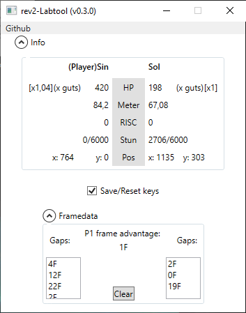

# GGxrd rev2 Labtool
External tool adding more features to the training mode of Guilty Gear Xrd Rev2.

## How to use
0. Download rev2-Labtool here: https://github.com/PCvolt/rev2-Labtool/releases/download/0.3.0/rev2-labtool0.3.0.7z
1. Start GGxrd rev2
2. Boot up Labtool. It is recommended to close and start it up again everytime you switch characters.

## Features
- Value displays: HP, defense modifier, meter, RISC, stun with thresholds per characters, xy position
- Frame advantage display (even on Roman Cancels!)
- Gap display for both characters(up to 30F gaps), on block and even on hit
- Save&Reset positions, save with keyboard "2", and reset with keyboard "1" or joypad "select"

## Upcoming features
- Dynamic display of guts per character
- Customizable keys and buttons for Save&Reset feature

## Known bugs
- Crashes when changing characters, hence the recommendation.
- If you have the wrong characters displayed, you may want to hit left then right on the training menu's selected characters so that Labtool updates.
- Playing as P2 swaps some info on the display.

The project migrated from .NET Core to .NET Framework for compatibility purposes. 
